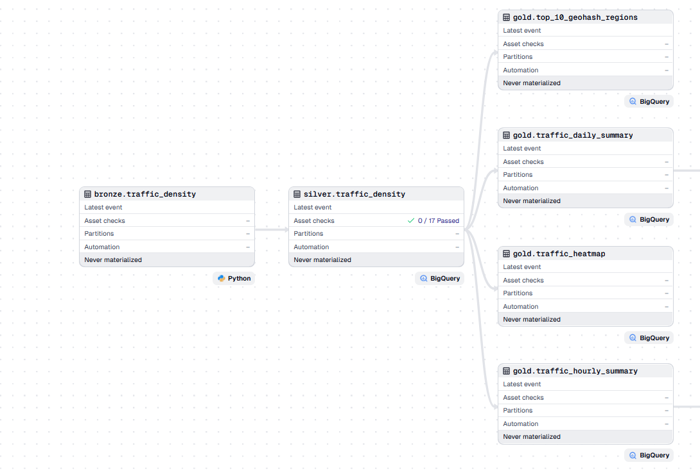
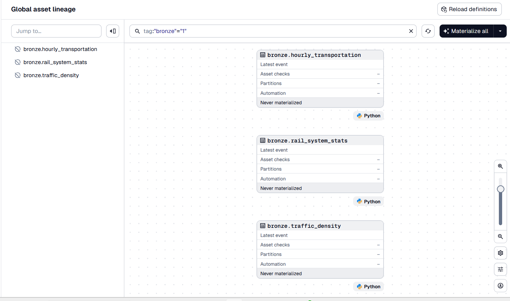
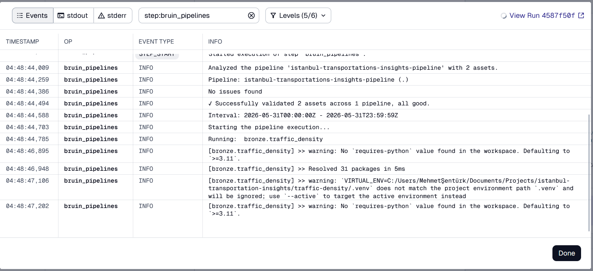
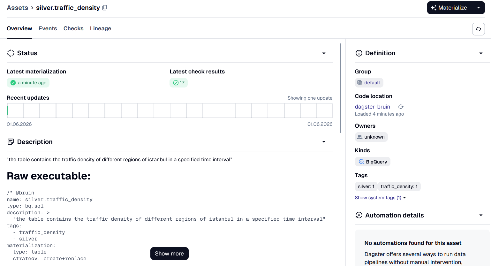
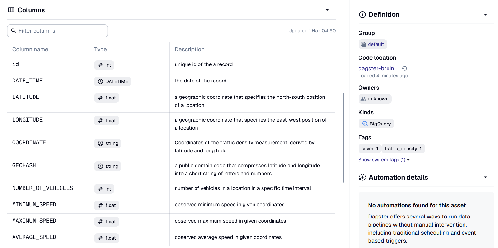
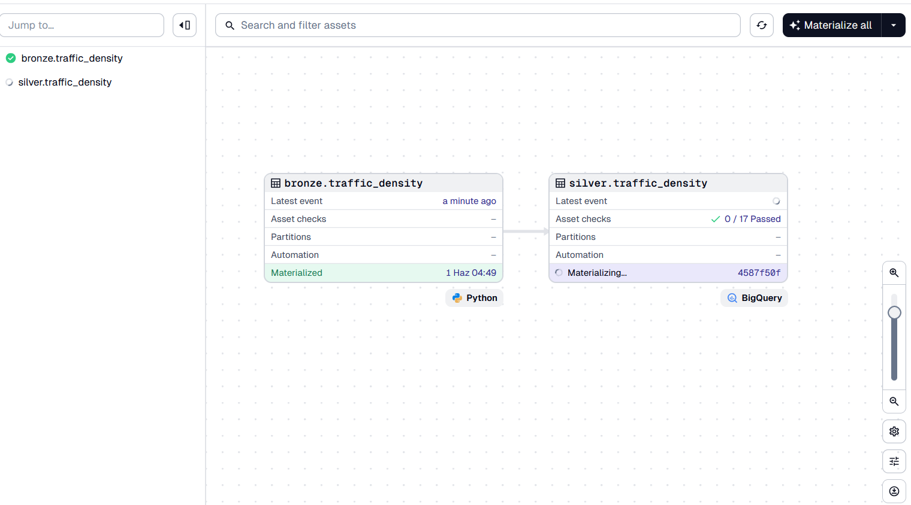
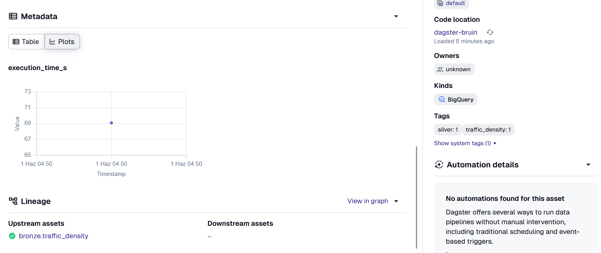
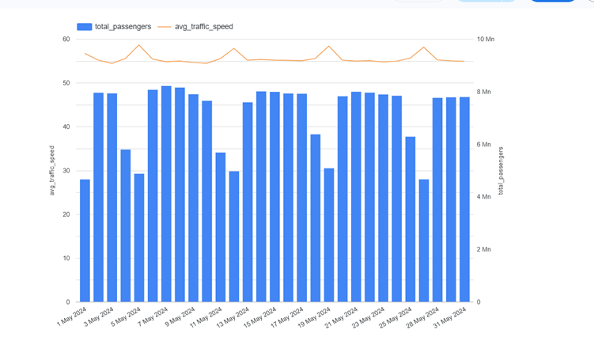
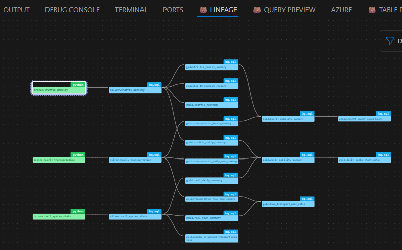

# Dagster-Bruin Integration

A seamless integration for orchestrating and observing [Bruin](https://getbruin.com/) pipelines directly within [Dagster](https://dagster.io/). 

This project automatically parses Bruin definitions, metadata, and tags, converting them into native Dagster assets. It allows data engineers to leverage Bruin's execution engine while utilizing Dagster's global asset graph, event logging, and execution tracking.

## 🚀 Getting Started

To test out the integration locally, follow these steps:

### Prerequisites
* `uv` installed for fast Python package management.
* A working Bruin pipeline directory.
* The Bruin CLI executable path.

### Installation & Setup

1. Sync the environment and install dependencies:
```bash
cd dagster-bruin
uv sync
```

2. Set your environment variables so the integration knows where to find Bruin and your pipeline project:
```bash
export BRUIN_EXECUTABLE_PATH=/path/to/your/bruin_executable
export BRUIN_PIPELINE_DIRECTORY=/path/to/your/bruin_pipeline_directory
```

3. Launch the Dagster development server:
```bash
cd ..
dagster dev -m dagster-bruin
```

4. Open your browser and navigate to **`http://localhost:3000`** to view the UI.

---

## 🛠️ Features & Walkthrough

The integration automatically translates your Bruin project into a rich, interactive Dagster workspace. Here is what you can expect when you launch the UI:

### 1. Global Asset Lineage
Dagster visualizes the full lineage of your Bruin pipelines. You can easily trace the flow of data from extraction to aggregated insights—such as tracking traffic density data from raw `bronze` ingestion all the way down to `gold` analytical heatmaps and regional summaries.



### 2. Native Tag Filtering
Bruin tags are automatically parsed into Dagster tags. By using the search bar, you can instantly filter the global asset graph to focus on specific domains, teams, or pipeline layers (for example, isolating all `bronze` assets).



### 3. Integrated Execution Logs
You don't need to check terminal outputs to see what Bruin is doing. During materialization, Bruin's pipeline validation and step-by-step execution logs are streamed directly into the Dagster event viewer for easy debugging.



### 4. Code & Definition Surfacing
The integration extracts your pipeline definitions and displays them right in the asset catalog. You can inspect descriptions, assigned groups, and the raw executable code (like Bruin SQL queries) without ever having to open your IDE. 



### 5. Column-Level Metadata Parsing
Column definitions are successfully bridged from Bruin into Dagster. Data types and column descriptions (e.g., geographic coordinates, speeds, and timestamps) are cleanly mapped, improving data governance and discoverability for downstream consumers.



### 6. Real-Time Execution Tracking & Metrics
Watch your materializations happen in real time on the lineage graph. Furthermore, custom metadata—such as pipeline execution time (`execution_time_s`)—is captured and plotted in the Dagster UI, allowing you to monitor performance trends over time.




---

## 📁 Project Structure

```text
istanbul-transportation-insights/
├── .bruin.yml
├── .env
├── .gitignore
├── README.md
├── .github/                  # GitHub Actions workflows
├── bruin/                    # Bruin pipeline definitions
├── dagster-bruin/            # Dagster integration source code
├── images/                   # Screenshots for documentation
├── logs/                     # Execution logs
├── terraform/                # Infrastructure as code definitions
└── traffic-density/          # Traffic density project / pipelines
```

---

## 📊 Exploratory Data Analysis Results

An exploratory data analysis visualization illustrating the daily relationship between total passenger volume and average traffic speed throughout specific dates.



---

## 🔗 Bruin Lineage

This is how the asset lineage and dependencies are visualized natively within Bruin.


